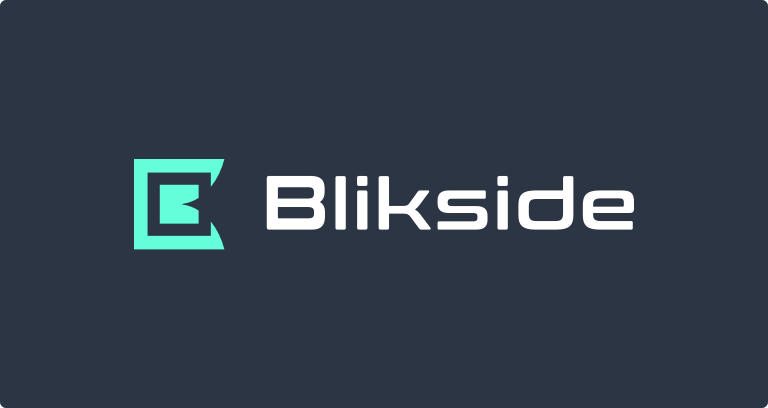

<div align="center">

  [](https://blikside.com)

  ### Blikside

</div>


## Документация
- [Обзор](#обзор)
    - [Технологии](#технологии)
    - [Структура папок](#структура-папок)
    - [Стиль кода](#стиль-кода)
- [Первая настройка](#первая-настройка)
- [Локальный запуск приложений](#локальный-запуск-приложений)


### Обзор

#### Технологии

Архитектура репозитория:

- **Full-stack JavaScript**: мы используем Node.js для серверов и React для поддержки наших веб-приложений. Почти весь код в этом репозитории написан на JavaScript.

Список всех больших технологий:

- [**MongoDB**](https://www.mongodb.com/): Data Storage
- [**mongoose**](https://mongoosejs.com/): Модели для MongoDB
- [**PassportJS**](http://www.passportjs.org): аутентификация
- [**React**](https://facebook.github.io/react/): Frontend приложение
- [**Create React App**](https://facebook.github.io/create-react-app/): Frontend приложение
- [**React-Native**](https://facebook.github.io/react-native/): Мобильные приложения
- [**Expo**](https://expo.io/): Набор библиотек для React-Native

#### Структура Проекта

```sh
blikside/
├── api        # API сервер
├── mobile     # Мобильные приложения (сборка с Expo)
├── public     # Открытые файлы, используемые во внешнем интерфейсе
├── shared     # Общий JavaScript код
└── src        # Frontend SPA
```

#### Стиль кода

Мы запускаем Prettier on-commit, это означает, что вы можете писать код в любом стиле и он будет автоматически отформатирован в соответствии с общим стилем при запуске git commit.

##### Правила
- Мы используем модуль отладки `debug` для регистрации отладочной информации в `development` среде. В production мы используем `winston` для регистрации логов.


### Первая настройка

Для начала клонируйте репозиторий:
```sh
git clone git@github.com:artemkrynkin/blikside.git
```
 If you get `Permission denied` error using `ssh` refer [here](https://help.github.com/articles/error-permission-denied-publickey/)
or use `https` link as a fallback.
```sh
git clone https://github.com/artemkrynkin/blikside.git
```

#### Установка

Blikside имеет 3 больших этапа установки:

1. **Установка MongoDB**: см. [Документацию MongoDB](https://docs.mongodb.com/guides/server/install/) для получения инструкций по установке его с вашей ОС.
2. **Установка yarn**: мы используем yarn для установки зависимостей JavaScript. Инструкции по установке смотрите в [документации yarn](https://yarnpkg.com/en/docs/install).
3. **Установка зависимостей**: чтобы не устанавливать зависимости для каждого сервиса в отдельности, есть сценарий, который проходит и выполняет `yarn install` для каждого сервиса вместо вас: (установка может занять некоторое время)
```sh
node shared/install-dependencies.js
```

Вы закончили установку! 💥

### Локальный запуск приложений

#### Фоновые сервисы

Каждый раз когда вы хотите запустить Blikside локально, вы должны запуска MongoDB работающую в фоновом режиме.

```sh
mongod
```

#### Запустите серверы

В зависимости от того, над чем вы хотите работать, вам нужно запустить разные серверы. Все серверы работают в режиме разработки `yarn run dev:<workername>`, например, `yarn run dev:web` для запуска Frontend SPA.

Независимо от того, то вы пытаетесь сделать, вам нужно будет запустить API, поэтому начните с фоновой вкладки:
```sh
yarn run dev:api
```

#### Frontend интерфейс
```sh
yarn run dev:web
```

#### Разработка мобильных приложений

Для разработки мобильного приложения необходимо чтобы API сервер работал в фоновом режиме (`yarn run dev:api`), затем на другой вкладке терминала запустите:
```sh
yarn run dev:mobile
```
